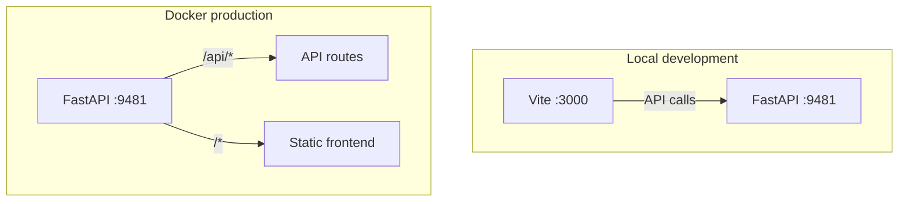

# RAG Chatbot

RAG chatbot over the MadeTech handbook. Uses Groq for chat, ChromaDB for semantic search, and OpenAI embeddings.

## Prerequisites

- **Local development**: Python 3.12+, Node.js 18+, [uv](https://docs.astral.sh/uv/)
- **Docker**: Docker only (no other dependencies)

## Environment variables

Create `backend/.env` with the following (or copy from `backend/.env.example`):

| Variable | Purpose | Required |
|----------|---------|----------|
| `GROQ_API_KEY` | Primary LLM for chat and highlights | Yes |
| `OPENAI_API_KEY` | Embeddings and fallback LLM | Yes |
| `GEMINI_API_KEY` | Fallback for highlights | Optional |

## Local development

### 1. Backend setup

```bash
cd backend
uv venv
```

Activate the virtual environment:

- **Windows**: `.venv\Scripts\activate`
- **Unix/Mac**: `source .venv/bin/activate`

```bash
uv pip install -e .
```

Create or copy `backend/.env` with the required variables.

### 2. Vector database (first-time only)

From the `backend/` directory:

```bash
python -m scripts.ingest
```

This populates `backend/data/vector_db/` from the handbook markdown files.

### 3. Start the backend

From the `backend/` directory:

```bash
uvicorn src.app:app --reload --port 9481
```

### 4. Frontend setup (separate terminal)

```bash
cd frontend
npm install
npm run dev
```

### 5. Access the app

Open http://localhost:3000. The frontend (Vite on port 3000) connects to the backend API (port 9481).

## Docker

Build and run with a single server (API + built frontend):

```bash
docker build -t madetech-rag-assistant .
docker run -p 9481:9481 --env-file backend/.env madetech-rag-assistant
```

Open http://localhost:9481.

## Architecture



Local development runs the frontend and backend separately. Docker serves both from a single FastAPI process.
