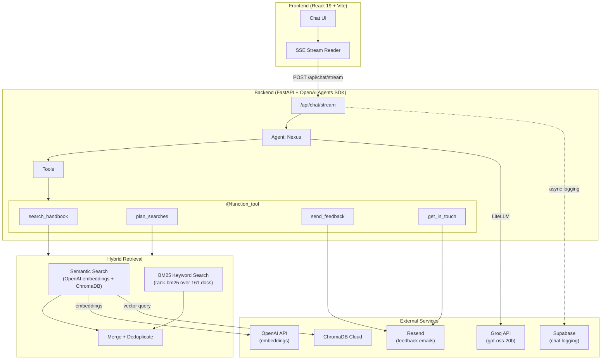

# Nexus — Agentic RAG Chatbot for the Made Tech Handbook

An agentic RAG chatbot that helps employees find answers across 161 company handbook documents using hybrid search (semantic + keyword), multi-step planning, and real-time tool transparency.

> **Why this exists:** Nobody reads HR policies until they need a quick answer. The usual path — searching folders, emailing HR, asking colleagues — is slow and often outdated. Nexus gives employees 24/7 access to grounded, conversational answers referenced in official documents.

## Key Features

- **Agentic architecture** — OpenAI Agents SDK with `@function_tool` decorators. The LLM autonomously decides when to search, plan multi-step queries, or answer directly.
- **Hybrid search** — Combines semantic search (OpenAI embeddings + ChromaDB) with BM25 keyword search for exact term matching (ISO 27001, BPSS, etc.).
- **Multi-step planning** — `plan_searches` tool executes multiple handbook searches at once for comparison questions, with cross-search deduplication.
- **Real-time transparency** — SSE streaming shows each tool step as it happens (live checklist with progress indicators).
- **Smart routing** — Structural questions ("What roles exist?") answered from the system prompt. Follow-ups resolved via tool-call query rewriting. Greetings handled without search.
- **Input guardrails** — English-only, Made Tech-related, with polite redirects for off-topic or gibberish input.
- **Feedback & contact tools** — Users can send feedback or contact the creator through natural conversation.

## Architecture


```mermaid
flowchart TB
    subgraph Frontend ["Frontend (React 19 + Vite)"]
        UI[Chat UI]
        SSE[SSE Stream Reader]
        UI --> SSE
    end

    subgraph Backend ["Backend (FastAPI + OpenAI Agents SDK)"]
        API["/api/chat/stream"]
        Agent["Agent: Nexus"]
        Tools["Tools"]
        API --> Agent

        subgraph ToolSet ["@function_tool"]
            SH[search_handbook]
            PS[plan_searches]
            SF[send_feedback]
            GT[get_in_touch]
        end
        Agent --> Tools
        Tools --> ToolSet
    end

    subgraph Retrieval ["Hybrid Retrieval"]
        Semantic["Semantic Search\n(OpenAI embeddings + ChromaDB)"]
        BM25["BM25 Keyword Search\n(rank-bm25 over 161 docs)"]
        Merge["Merge + Deduplicate"]
        Semantic --> Merge
        BM25 --> Merge
    end

    subgraph External ["External Services"]
        Groq["Groq API\n(gpt-oss-20b)"]
        OAI["OpenAI API\n(embeddings)"]
        Chroma["ChromaDB Cloud"]
        Supa["Supabase\n(chat logging)"]
        Resend["Resend\n(feedback emails)"]
    end

    SSE -->|POST /api/chat/stream| API
    SH --> Retrieval
    PS --> Retrieval
    Agent -->|LiteLLM| Groq
    Semantic -->|embeddings| OAI
    Semantic -->|vector query| Chroma
    SF --> Resend
    GT --> Resend
    API -.->|async logging| Supa
```

### Request Flow

```
User sends message
  → Frontend POST /api/chat/stream (SSE)
  → Agent "Nexus" receives question + history
  → LLM decides: answer directly OR call tools
    ├─ Simple question → search_handbook (1 search)
    ├─ Complex/comparison → plan_searches (2-3 searches at once)
    ├─ Structural ("what roles exist?") → answer from system prompt
    ├─ Greeting → direct response, no tools
    └─ Feedback/contact → collect info, then send_feedback or get_in_touch
  → Each tool step streamed to frontend as SSE event
  → Final answer + sources streamed as "done" event
  → Frontend renders checklist → answer → sources
```

## Prerequisites

- **Local development**: Python 3.12+, Node.js 18+, [uv](https://docs.astral.sh/uv/)
- **Docker**: Docker only

## Quick Start

### 1. Backend

```bash
cd backend
uv venv
```

Activate the virtual environment:
- **Windows**: `.venv\Scripts\activate`
- **Unix/Mac**: `source .venv/bin/activate`

```bash
uv pip install -e .
```

Create `backend/.env` (see [Environment Variables](#environment-variables)).

```bash
uvicorn src.app:app --reload --port 9481
```

### 2. Frontend (separate terminal)

```bash
cd frontend
npm install
npm run dev
```

Open http://localhost:3000.

### 3. Docker (production)

```bash
docker build -t madetech-rag-assistant .
docker run -p 9481:9481 --env-file backend/.env madetech-rag-assistant
```

Open http://localhost:9481.

## Environment Variables

Create `backend/.env` (see `backend/.env.example`):

| Variable | Purpose | Required |
|----------|---------|----------|
| `GROQ_API_KEY` | Primary LLM (Groq) | Yes |
| `OPENAI_API_KEY` | Embeddings + fallback LLM | Yes |
| `CHROMA_API_KEY` | ChromaDB Cloud | Yes |
| `TENANT_CHROMA` | ChromaDB Cloud tenant | Yes |
| `DATABASE_URL` | Supabase PostgreSQL (chat logging) | No |
| `RESEND_API_KEY` | Email service (feedback/contact) | No |
| `CONTACT_EMAIL` | Feedback destination email | No |

## Configuration

RAG behavior is controlled by `backend/config.yaml`:

```yaml
model: "groq/openai/gpt-oss-20b"
retrieval:
  retrieval_k: 10
  final_k: 10
approach:
  use_query_rewriting: false    # Redundant — orchestrator rewrites via tool calls
  use_reranking: false          # Basic RAG won in experiments
  use_keyword_search: true      # BM25 hybrid search
```

## Project Structure

```
madetech-rag-assistant/
├── backend/
│   ├── config.yaml              # RAG pipeline configuration
│   ├── src/
│   │   ├── app.py               # FastAPI routes + SSE streaming
│   │   ├── rag_service.py       # RAG orchestration
│   │   ├── rag/
│   │   │   ├── agent_pipeline.py    # OpenAI Agents SDK pipeline
│   │   │   ├── pipeline.py          # Legacy pipeline (experiments)
│   │   │   ├── retrieval.py         # ChromaDB semantic search
│   │   │   └── keyword_search.py    # BM25 keyword search
│   │   ├── chat_logger.py       # Supabase logging
│   │   └── contact_service.py   # Resend email
│   ├── utils/
│   │   ├── models.py            # Pydantic models
│   │   └── prompts.py           # System prompts
│   └── data/handbook/           # 161 markdown source files
├── frontend/
│   ├── App.tsx                  # Root component + state management
│   ├── components/
│   │   ├── ChatArea.tsx         # Messages, input, live tool steps
│   │   ├── MarkdownRenderer.tsx # Themed markdown rendering
│   │   ├── SourceViewer.tsx     # Document inspection panel
│   │   └── WelcomeModal.tsx     # Onboarding modal
│   └── services/
│       └── apiService.ts        # SSE + REST API client
├── experiments/                 # Evaluation framework
│   ├── notebooks/               # Jupyter analysis notebooks
│   └── scripts/                 # Automated experiment runners
└── Dockerfile                   # Multi-stage production build
```

## Experiments

The `experiments/` directory contains a full evaluation framework for benchmarking RAG configurations, models, and retrieval strategies. See [`experiments/README.md`](experiments/README.md) for details.

Key findings:
- **Best configuration**: Basic RAG with `groq/openai/gpt-oss-20b` (no rewriting, no reranking)
- **Query rewriting confirmed redundant**: The orchestrator LLM already rewrites queries via tool calls
- **Latency and failure tracking**: Mean/p50/p95 latency + RAG/judge error rates per experiment

## License

MIT

## Author

Built by [Sergio Vanegas](https://www.linkedin.com/in/sergio-vanegas/) — [View source code](https://github.com/smvanegasp/madetech-rag-assistant)
