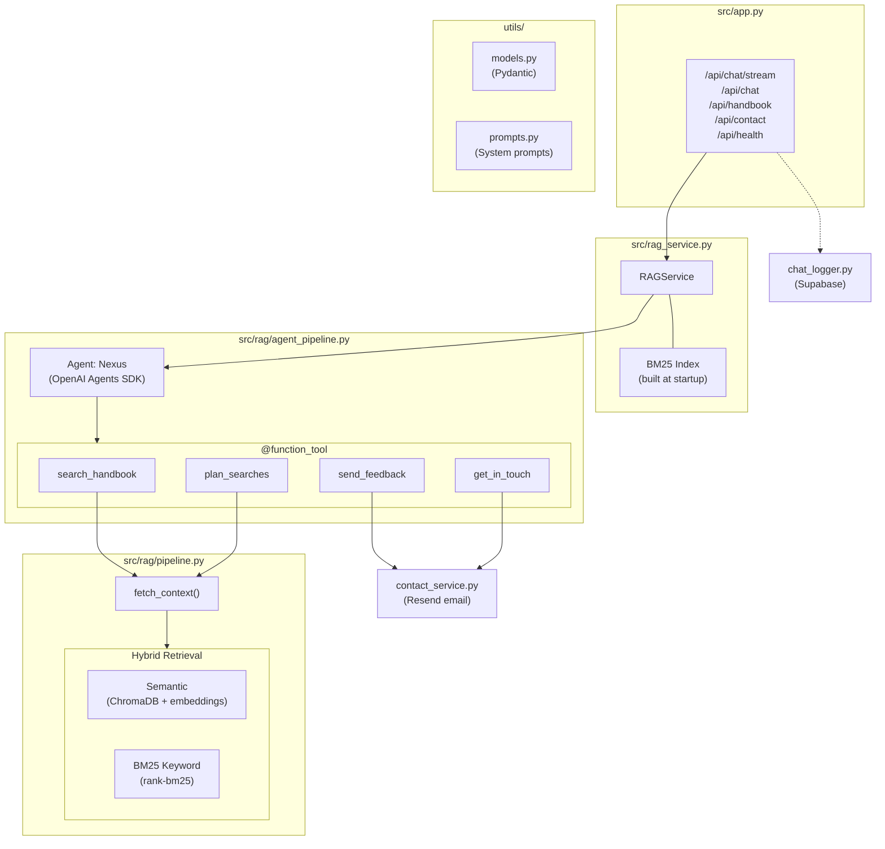
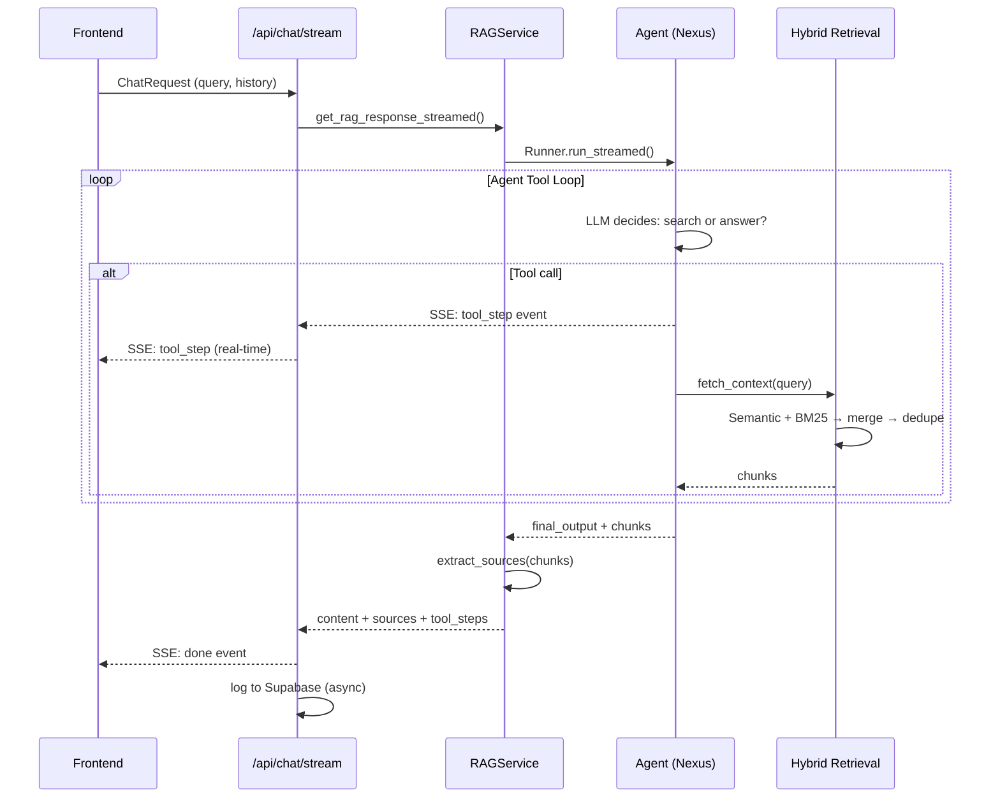

# Backend — FastAPI + OpenAI Agents SDK

FastAPI backend powering the Nexus chatbot. Uses the OpenAI Agents SDK for agentic tool orchestration, ChromaDB Cloud for semantic search, BM25 for keyword search, and Groq for LLM inference.

## Quick Start

```bash
cd backend
uv venv && source .venv/bin/activate  # or .venv\Scripts\activate on Windows
uv pip install -e .
uvicorn src.app:app --reload --port 9481
```

Requires `backend/.env` with API keys (see [Environment Variables](#environment-variables)).

## Architecture



## Directory Structure

```
backend/
├── config.yaml                  # RAG pipeline configuration
├── pyproject.toml               # Dependencies (UV)
├── src/
│   ├── app.py                   # FastAPI app, routes, SSE streaming, startup
│   ├── config_loader.py         # Load and resolve config.yaml
│   ├── rag_service.py           # RAG orchestration, BM25 index init, source extraction
│   ├── handbook_loader.py       # Load .md files → HandbookDoc objects
│   ├── chat_logger.py           # Async chat logging to Supabase PostgreSQL
│   ├── contact_service.py       # Feedback/contact emails via Resend
│   └── rag/                     # RAG pipeline modules
│       ├── agent_pipeline.py    # OpenAI Agents SDK: agent, tools, streaming
│       ├── pipeline.py          # Legacy pipeline (kept for experiments)
│       ├── retrieval.py         # ChromaDB Cloud + OpenAI embeddings
│       ├── keyword_search.py    # BM25 keyword search index
│       ├── query_rewriting.py   # LLM query expansion (disabled in production)
│       └── reranking.py         # LLM chunk reordering (disabled in production)
├── utils/
│   ├── models.py                # All Pydantic models (API, RAG, evaluation)
│   └── prompts.py               # System prompts (tool decision, RAG, rewriting, etc.)
├── data/
│   └── handbook/                # 161 markdown source files (6 categories)
└── scripts/
    └── 01_llm_chunking_embedding/  # Vector DB ingestion pipeline
```

## Request Flow

### Streaming Chat (`POST /api/chat/stream`)



### Non-streaming Chat (`POST /api/chat`)

Same flow but returns a single JSON `ChatResponse` instead of SSE events. Used as fallback.

## Agent Tools

| Tool | Purpose | When Used |
|------|---------|-----------|
| `search_handbook` | Single semantic + keyword search | Simple, single-topic questions |
| `plan_searches` | Multiple searches at once, deduplicated | Comparisons, multi-topic questions |
| `send_feedback` | Send feedback email via Resend | User explicitly asks to give feedback |
| `get_in_touch` | Send contact email via Resend | User explicitly asks to contact creator |

Tools are defined with `@function_tool` decorators in `agent_pipeline.py`. The SDK auto-generates JSON schemas from function signatures. `send_feedback` and `get_in_touch` include field validation — they reject calls with missing/placeholder data and instruct the LLM to ask the user.

## Configuration

`config.yaml` controls the RAG pipeline:

| Key | Description | Default |
|-----|-------------|---------|
| `vector_db.database` | ChromaDB Cloud database | `madetech_handbook` |
| `vector_db.collection_name` | ChromaDB collection | `docs` |
| `embedding_model` | Must match ingestion model | `text-embedding-3-large` |
| `retrieval.retrieval_k` | Chunks retrieved per query | `10` |
| `retrieval.final_k` | Chunks passed to LLM | `10` |
| `model` | LLM for the agent | `groq/openai/gpt-oss-20b` |
| `approach.use_query_rewriting` | Explicit query rewriting (disabled) | `false` |
| `approach.use_reranking` | LLM chunk reordering (disabled) | `false` |
| `approach.use_keyword_search` | BM25 hybrid search | `true` |

## System Prompt

The `TOOL_DECISION_SYSTEM_PROMPT` in `utils/prompts.py` contains:

- Nexus identity and behavioral rules
- Dynamic date injection (`{today}`)
- Project context and disclaimers
- Complete handbook content index (all 161 documents, human-readable names)
- Topics the handbook does NOT cover
- Tool usage guidance (when to search, when to plan, when to answer directly)
- Input guardrails (English-only, Made Tech-related, gibberish detection)
- Formatting guidelines (bold, tables max 4 columns, concise with offer to elaborate)

## Environment Variables

| Variable | Purpose | Required |
|----------|---------|----------|
| `GROQ_API_KEY` | Groq LLM API | Yes |
| `OPENAI_API_KEY` | Embeddings + fallback | Yes |
| `CHROMA_API_KEY` | ChromaDB Cloud | Yes |
| `TENANT_CHROMA` | ChromaDB Cloud tenant | Yes |
| `DATABASE_URL` | Supabase PostgreSQL (chat logging) | No |
| `RESEND_API_KEY` | Resend email API | No |
| `CONTACT_EMAIL` | Feedback destination | No |
| `RAG_CONFIG_PATH` | Override config.yaml path | No |
| `FRONTEND_PATH` | Static frontend dir (Docker) | No |

## API Endpoints

| Method | Path | Description |
|--------|------|-------------|
| `POST` | `/api/chat/stream` | SSE streaming chat (primary) |
| `POST` | `/api/chat` | Non-streaming chat (fallback) |
| `GET` | `/api/handbook` | All handbook documents (source viewer) |
| `POST` | `/api/contact` | Direct contact/feedback email |
| `GET` | `/api/health` | Health check + document count |

## Vector DB Ingestion

First-time setup (from `backend/` directory):

```bash
python -m scripts.ingest
```

Chunks handbook markdown → generates LLM headlines/summaries → embeds with `text-embedding-3-large` → stores in ChromaDB Cloud.
