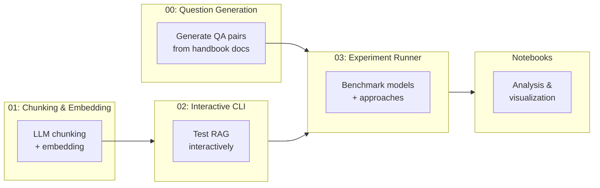

# Experiments — Evaluation & Benchmarking

Evaluation framework for testing RAG configurations, LLM models, retrieval strategies, and answer quality. Contains automated experiment runners, Jupyter analysis notebooks, and evaluation datasets.

## Overview



## Directory Structure

```
experiments/
├── notebooks/                              # Jupyter analysis notebooks
│   ├── 06_experiment_rerank_rewrite.ipynb   # Rerank/rewrite results analysis
│   └── 08_double_rewriting_investigation.ipynb  # Query rewriting redundancy study
├── scripts/
│   ├── 00_questions_generation/            # Generate evaluation QA pairs from handbook
│   ├── 01_llm_chunking_embedding/          # LLM-based document chunking + embedding
│   ├── 02_advanced_rag_interactive_cli/    # Interactive RAG testing CLI
│   ├── 03_experiment_rerank_rewrite/       # Automated experiment runner
│   └── 99_archive/                         # Archived older scripts
├── utils/                                  # Shared models and prompts for experiments
└── requirements.txt                        # Experiment-specific dependencies
```

## Scripts

### 00 — Question Generation

Generates evaluation QA pairs from handbook documents using LLM. Produces both single-source and multi-source questions in JSONL format.

```bash
python -m experiments.scripts.00_questions_generation.main
```

### 01 — LLM Chunking & Embedding

Chunks handbook documents using LLM-generated headlines and summaries, then embeds with OpenAI `text-embedding-3-large` and stores in ChromaDB.

```bash
python -m experiments.scripts.01_llm_chunking_embedding.main
```

### 02 — Interactive RAG CLI

Interactive command-line interface for testing RAG queries. Useful for quick manual testing of retrieval quality.

```bash
python -m experiments.scripts.02_advanced_rag_interactive_cli.main
```

### 03 — Experiment Runner

Automated benchmarking across multiple models and RAG approaches. Evaluates each configuration using LLM-as-judge scoring (accuracy, completeness, relevance) with latency and failure tracking.

```bash
python -m experiments.scripts.03_experiment_rerank_rewrite.main
```

**Features:**
- Per-experiment `model` field — test different LLMs side by side
- Separate `judge_model` for fair cross-model comparison
- Latency tracking: mean, p50, p95 per experiment
- Failure tracking: RAG errors vs judge/structured output errors
- Automated plots: scores, latency, failure rates, distributions

**Current models tested:**
| Model | Provider | Notes |
|-------|----------|-------|
| `groq/openai/gpt-oss-20b` | Groq (free) | Production model |
| `openai/gpt-4o-mini` | OpenAI | Premium baseline |
| `groq/llama-3.1-8b-instant` | Groq (free) | Fast/cheap baseline |

**Judge model:** `groq/llama-3.3-70b-versatile` (free, strong, independent)

See [`scripts/03_experiment_rerank_rewrite/README.md`](scripts/03_experiment_rerank_rewrite/README.md) for full configuration.

## Notebooks

### 06 — Experiment Analysis

Visualizes results from the experiment runner. Loads `results.json` and `summary.csv` to generate score comparisons, distribution plots, and identifies the best configuration.

### 08 — Double Rewriting Investigation

Tests whether the orchestrator LLM already rewrites queries when calling the `search_handbook` tool, making the explicit `query_rewriting.py` step redundant.

**Conclusion:** The orchestrator's tool-call query is as good or better than the explicit rewrite in all 8 test scenarios. Combined with experiment results showing basic RAG as the best configuration, explicit query rewriting is confirmed redundant.

## Key Findings

| Finding | Evidence | Impact |
|---------|----------|--------|
| Basic RAG is best | Experiment 03: highest overall score | Disabled rewriting and reranking in production |
| Query rewriting is redundant | Notebook 08: 8/8 scenarios | Saves one LLM call per query |
| `gpt-oss-20b` wins on quality + cost | Experiment 03: best accuracy at $0 | Kept as production model |
| BM25 improves keyword queries | Manual testing: "BPSS", "ISO 27001" | Enabled hybrid search in production |

## Setup

```bash
cd experiments
pip install -r requirements.txt
```

Ensure `backend/.env` has the required API keys (`GROQ_API_KEY`, `OPENAI_API_KEY`, `CHROMA_API_KEY`, `TENANT_CHROMA`).
